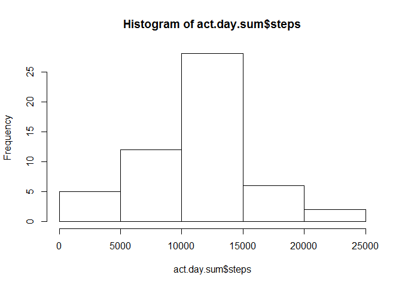
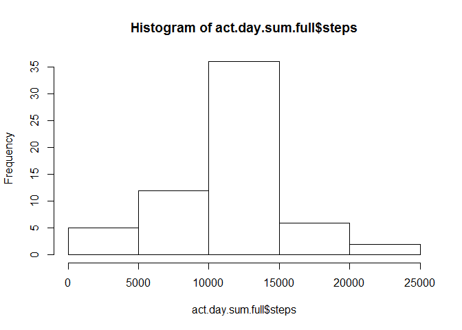
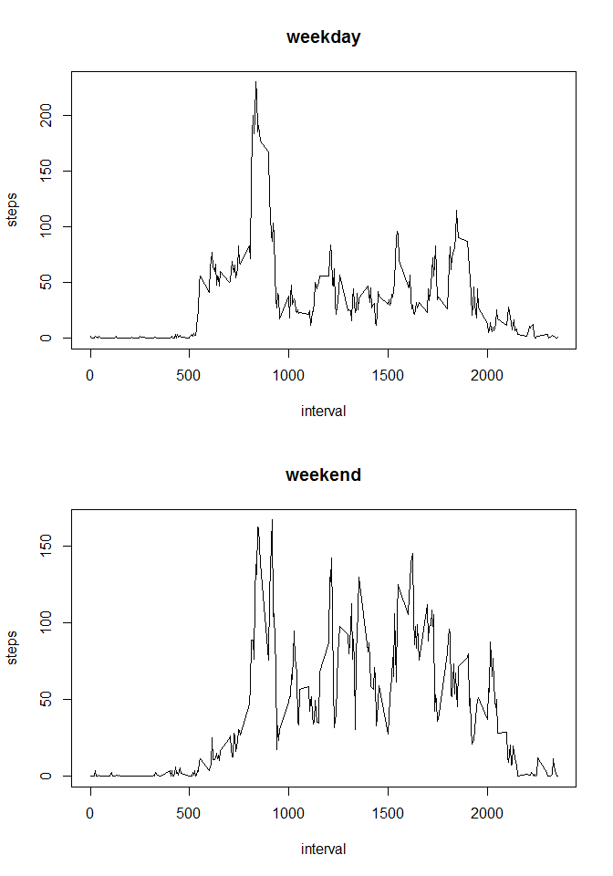

# Reproducible Research: Peer Assessment 1


## Loading and preprocessing the data

```r
if(!file.exists("activity.csv"))unzip("activity.zip")
activity<-read.csv("activity.csv")
activity$date<-as.Date(activity$date,"%Y-%m-%d")
str(activity)
```

```
## 'data.frame':	17568 obs. of  3 variables:
##  $ steps   : int  NA NA NA NA NA NA NA NA NA NA ...
##  $ date    : Date, format: "2012-10-01" "2012-10-01" ...
##  $ interval: int  0 5 10 15 20 25 30 35 40 45 ...
```


## What is mean total number of steps taken per day?


```r
act.day.sum<-aggregate(steps~date,activity,sum)
hist(act.day.sum$steps)
```

<!-- -->

```r
act.day.mean<-aggregate(steps~date,activity,mean)
act.day.median<-aggregate(steps~date,activity,median)
head(act.day.mean)
```

```
##         date    steps
## 1 2012-10-02  0.43750
## 2 2012-10-03 39.41667
## 3 2012-10-04 42.06944
## 4 2012-10-05 46.15972
## 5 2012-10-06 53.54167
## 6 2012-10-07 38.24653
```

```r
head(act.day.median)
```

```
##         date steps
## 1 2012-10-02     0
## 2 2012-10-03     0
## 3 2012-10-04     0
## 4 2012-10-05     0
## 5 2012-10-06     0
## 6 2012-10-07     0
```

## What is the average daily activity pattern?

```r
act.int.mean<-aggregate(steps~interval,activity,mean)
int.max<-act.int.mean[which.max(act.int.mean$steps),"interval"]
plot(act.int.mean,type = "l")
```

<!-- -->

>###**The 5-minute interval that, on average, contains the maximum number of steps is** *835*


## Imputing missing values


```r
colSums(is.na(activity))
```

```
##    steps     date interval 
##     2304        0        0
```

```r
actvNA<-which(is.na(activity$steps))
actvfull<-activity
for(i in actvNA){
  actvfull$steps[i]<-act.int.mean$steps[act.int.mean$interval==actvfull$interval[i]]
}

colSums(is.na(actvfull))
```

```
##    steps     date interval 
##        0        0        0
```

```r
act.day.sum.full<-aggregate(steps~date,actvfull,sum)
hist(act.day.sum.full$steps)
```

<!-- -->

```r
act.day.mean.full<-aggregate(steps~date,actvfull,mean)
act.day.median.full<-aggregate(steps~date,actvfull,median)
head(act.day.mean.full)
```

```
##         date    steps
## 1 2012-10-01 37.38260
## 2 2012-10-02  0.43750
## 3 2012-10-03 39.41667
## 4 2012-10-04 42.06944
## 5 2012-10-05 46.15972
## 6 2012-10-06 53.54167
```

```r
head(act.day.median.full)
```

```
##         date    steps
## 1 2012-10-01 34.11321
## 2 2012-10-02  0.00000
## 3 2012-10-03  0.00000
## 4 2012-10-04  0.00000
## 5 2012-10-05  0.00000
## 6 2012-10-06  0.00000
```


## Are there differences in activity patterns between weekdays and weekends?


```r
weekend<-weekdays(actvfull$date,abbreviate=T) %in% c("Sat","Sun")
actvfull$weekflag<-"weekday"
actvfull$weekflag[weekend]<-"weekend"
actvfull$weekflag<-as.factor(actvfull$weekflag)
act.int.mean.week<-aggregate(steps~interval+weekflag,actvfull,mean)
par(mfrow=c(2,1))
plot(subset(act.int.mean.week,weekflag=="weekday")[,-2],type = "l",main = "weekday")
plot(subset(act.int.mean.week,weekflag=="weekend")[,-2],type = "l",main = "weekend")
```

<!-- -->
